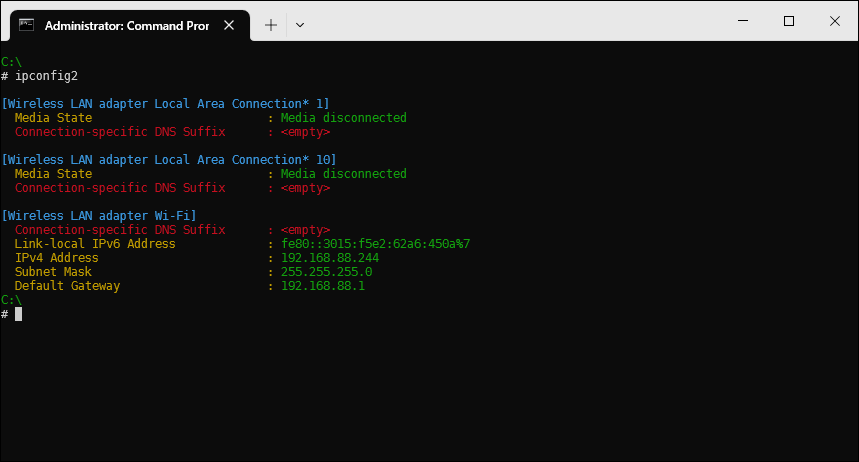

# wbs-ipconfig2

## About

`ipconfig2` is a PHP-based script that modifies the output of `ipconfig` and returns a output with colors.

## Note

This repository is part of [Windows Better Shell](https://github.com/oxou/wbs).
